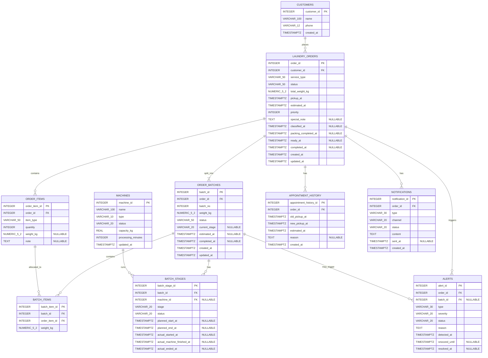

```mermaid
erDiagram

        CUSTOMERS {
        INTEGER customer_id PK
        VARCHAR_100 name
        VARCHAR_12 phone
        TIMESTAMPTZ created_at
    }

    MACHINES {
        INTEGER machine_id PK
        VARCHAR_100 name
        VARCHAR_10 type
        VARCHAR_20 status
        REAL capacity_kg
        INTEGER processing_minutes
        TIMESTAMPTZ updated_at
    }

    LAUNDRY_ORDERS {
        INTEGER order_id PK
        INTEGER customer_id FK
        VARCHAR_50 service_type
        VARCHAR_50 status
        NUMERIC_5_2 total_weight_kg
        TIMESTAMPTZ pickup_at
        TIMESTAMPTZ estimated_at
        INTEGER priority
        TEXT special_note "NULLABLE"
        TIMESTAMPTZ classified_at "NULLABLE"
        TIMESTAMPTZ packing_completed_at "NULLABLE"
        TIMESTAMPTZ ready_at "NULLABLE"
        TIMESTAMPTZ completed_at "NULLABLE"
        TIMESTAMPTZ created_at
        TIMESTAMPTZ updated_at
    }

    ORDER_ITEMS {
        INTEGER order_item_id PK
        INTEGER order_id FK
        VARCHAR_50 item_type
        INTEGER quantity
        NUMERIC_5_2 weight_kg "NULLABLE"
        TEXT note "NULLABLE"
    }

    ORDER_BATCHES {
        INTEGER batch_id PK
        INTEGER order_id FK
        INTEGER batch_no
        NUMERIC_5_2 weight_kg
        VARCHAR_50 status
        VARCHAR_20 current_stage "NULLABLE"
        TIMESTAMPTZ estimated_at "NULLABLE"
        TIMESTAMPTZ completed_at "NULLABLE"
        TIMESTAMPTZ created_at
        TIMESTAMPTZ updated_at
    }

    BATCH_ITEMS {
        INTEGER batch_item_id PK
        INTEGER batch_id FK
        INTEGER order_item_id FK
        NUMERIC_5_2 weight_kg
    }

    BATCH_STAGES {
        INTEGER batch_stage_id PK
        INTEGER batch_id FK
        INTEGER machine_id FK "NULLABLE"
        VARCHAR_20 stage
        VARCHAR_20 status
        TIMESTAMPTZ planned_start_at "NULLABLE"
        TIMESTAMPTZ planned_end_at "NULLABLE"
        TIMESTAMPTZ actual_started_at "NULLABLE"
        TIMESTAMPTZ actual_machine_finished_at "NULLABLE"
        TIMESTAMPTZ actual_ended_at "NULLABLE"
    }

    APPOINTMENT_HISTORY {
        INTEGER appointment_history_id PK
        INTEGER order_id FK
        TIMESTAMPTZ old_pickup_at
        TIMESTAMPTZ new_pickup_at
        TIMESTAMPTZ estimated_at
        TEXT reason "NULLABLE"
        TIMESTAMPTZ created_at
    }

    NOTIFICATIONS {
        INTEGER notification_id PK
        INTEGER order_id FK
        VARCHAR_30 type
        VARCHAR_20 channel
        VARCHAR_20 status
        TEXT content
        TIMESTAMPTZ sent_at "NULLABLE"
        TIMESTAMPTZ created_at
    }

    ALERTS {
        INTEGER alert_id PK
        INTEGER order_id FK
        INTEGER batch_id FK "NULLABLE"
        VARCHAR_30 type
        VARCHAR_20 severity
        VARCHAR_20 status
        TEXT reason
        TIMESTAMPTZ detected_at
        TIMESTAMPTZ snoozed_until "NULLABLE"
        TIMESTAMPTZ resolved_at "NULLABLE"
    }

    CUSTOMERS ||--o{ LAUNDRY_ORDERS : places
    LAUNDRY_ORDERS ||--o{ ORDER_ITEMS : contains
    LAUNDRY_ORDERS ||--|{ ORDER_BATCHES : split_into
    ORDER_BATCHES ||--o{ BATCH_ITEMS : contains
    ORDER_ITEMS ||--o{ BATCH_ITEMS : allocated_to
    ORDER_BATCHES ||--o{ BATCH_STAGES : has
    MACHINES ||--o{ BATCH_STAGES : runs
    LAUNDRY_ORDERS ||--o{ APPOINTMENT_HISTORY : has
    LAUNDRY_ORDERS ||--o{ NOTIFICATIONS : has
    LAUNDRY_ORDERS ||--o{ ALERTS : triggers
    ORDER_BATCHES ||--o{ ALERTS : may_trigger
```
